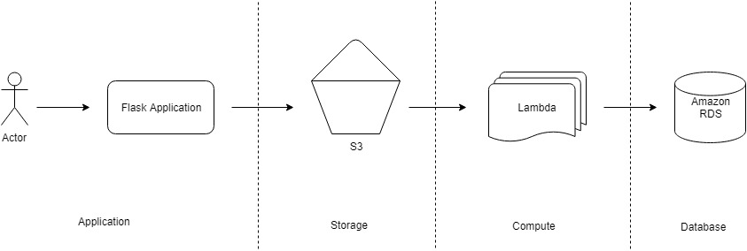
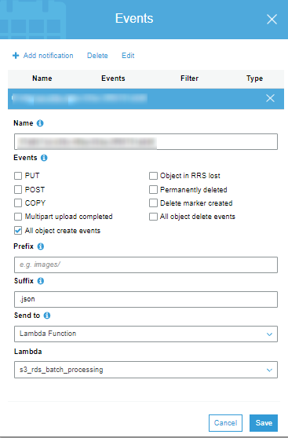
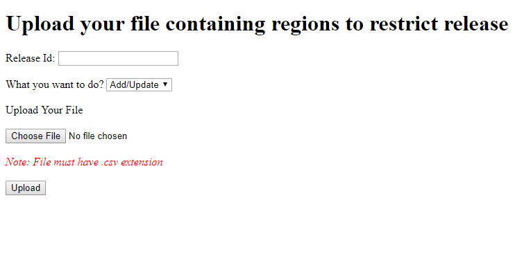

# Batch Processing using AWS Cloud

**Use Case**<br/>




1) Upload .csv using flask web application
2) Application logic splits .csv into batches
3) Batches push into Amazon S3 bucket
4) Once any batch arrives in S3 bucket, lambda function invokes per batch basis
5) Lambda process the batch and performs action(add/update/delete) on Amazon RDS

**Amazon RDS(MySQL)**<br/>

Database : batch_processing<br/>
Table : release_region_restriction
```
CREATE TABLE `release_region_restriction` (
  `id` int(11) NOT NULL AUTO_INCREMENT,
  `release_id` int(11) NOT NULL,
  `region_code` char(2) NOT NULL,
  PRIMARY KEY (`id`),
  UNIQUE KEY `idx_release_region_restriction` (`release_id`,`region_code`)
) ENGINE=InnoDB;
```

**Amazon S3**<br/>

Create a bucket to Amazon s3 ex: `<region>-batch-processing`. 
Make sure bucket name is universally unique.

**Amazon Lambda**<br/>

Create a lambda function to process batch.<br/>

Function name : [s3_rds_batch_processing](/s3_rds_batch_processing_lambda)<br/>
Language : Python v3.6.0<br/>
Environment variables:
1) RDS_HOST
2) RDS_USER
3) RDS_PASSWORD
4) RDS_DATABASE

Set trigger on s3 bucket.<br/>



Add all require policies to IAM role of lambda to access s3 and RDS resources.

Deployment package: [With Additional Dependencies](https://docs.aws.amazon.com/lambda/latest/dg/lambda-python-how-to-create-deployment-package.html#python-package-dependencies)<br/>

Make sure *pip* setuptool is installed with python package. Execute following commands.
```
$ cd s3_rds_batch_processing_lambda
$ pip install -r requirements-lambda.txt --target ./
```

Make a .zip of content from s3_rds_batch_processing_lambda directory. Upload this .zip to AWS lambda using option *Code entry type*.


**Flask Application**<br/>

The installation is very straightforward and make sure you are using at least python 3.6.x and later.
Make sure *pip* setuptool is installed with python package.

Create virtual environment using following commands.

```
$ cd flask_s3_uploads
$ pip install virtualenv
$ virtualenv env
```

Activate virtual environment.

*Linux or Mac*

```
$ source env/bin/activate
```

OR

*Windows*

```
$ env\Scripts\activate
```

Deactivate virtual environment.
```
(env) $ deactivate
```

Install dependencies/packages.

```
(env) $ pip install -r requirements.txt
```

Running

Set configurations in `/flask_s3_uploads/configs.py` 

When all dependencies installed and configurations are set, run the application.

```
(env) $ python runserver.py
```

Enter *http://127.0.0.1:5000/* or *http://localhost:5000/* url on browser.



Sample [.csv](/test.csv) file.
